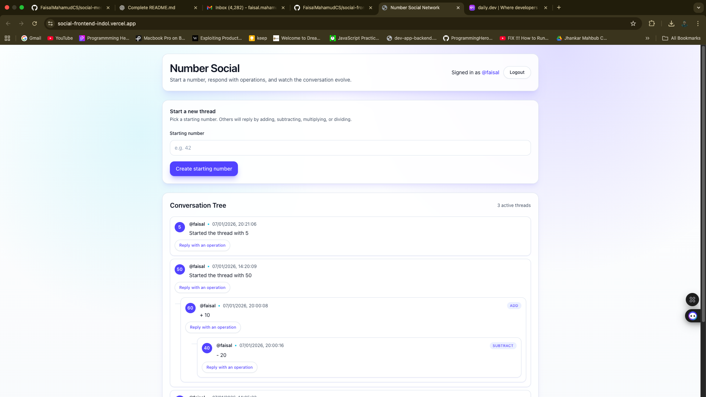

# Number Social Network - Frontend

This is the frontend of the **Number Social Network** project, built with **React**, **TypeScript**, and **Vite**.  
It allows users to view and interact with number-based discussion trees in real time.

---

## Features

- **User Authentication**: Login and register with username/password.
- **View Calculations**: Explore calculation trees created by other users.
- **Create Starting Numbers**: Registered users can post starting numbers.
- **Add Operations**: Users can respond to any calculation with mathematical operations (add, subtract, multiply, divide).
- **Real-time Updates**: New calculations appear immediately.
- **Responsive Design**: Works on desktop and mobile screens.

---


## Tech Stack

- **React** (TypeScript)
- **Vite** for development and bundling
- **Tailwind CSS** for styling
- **React Query / SWR** for API state management (if used)
- **Jest** + **React Testing Library** for tests

---

## Prerequisites

- Node.js 20+
- npm or yarn
- Backend API running (see backend README)

---

## Setup Instructions

### 1. Clone the repository (frontend)

```bash
cd social-backend
cd frontend

